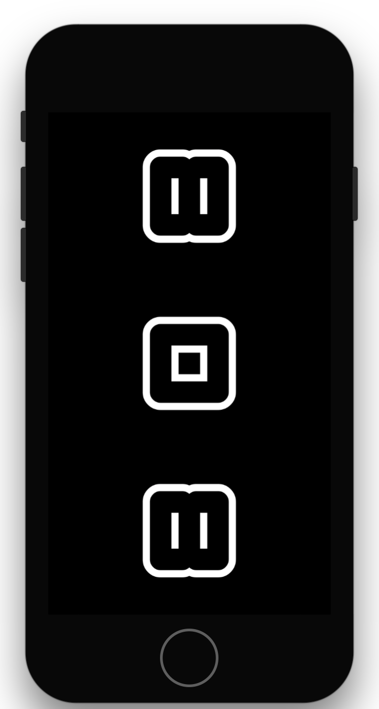

A STYLISH SOUNDBOARD APP FEATURING 808 DRUM SOUNDS

BASICALLY A WAY TO PLAY SOME OF MY FAVORITE INSTRUMENTS OF THE TR808 DRUM MACHINE...IN STYLE.

USES A 3RD PARTY SOUND LIBRARY THAT BASICALLY WRANGLES THE ANNOYING HASSLES OF AVFOUNDATION SETUP. (DO TRY CATCH TO PLAY A SOUND FILE? COME ON...)

